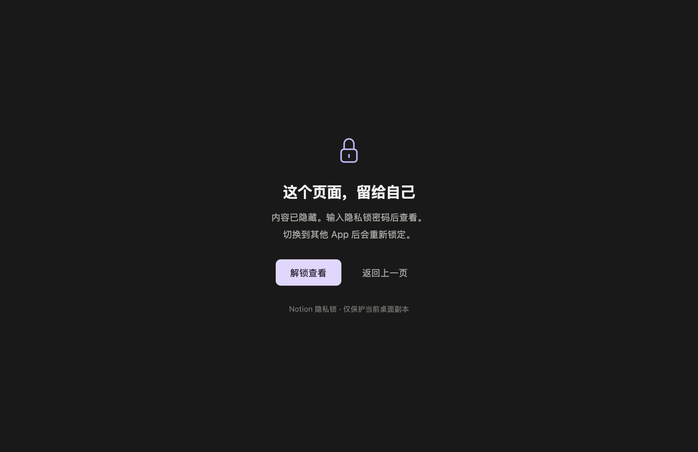

# Notion+（Mac 本机试用版）

为 Notion 桌面副本增加“锁住后隐藏内容”的功能。版本 0.1.0，针对本机 Notion 7.33.0 开发。当前已在 Apple Silicon、macOS 15.7.9 / Apple M2 上验证。

副本图标保留原版的圆角白色底板、方块比例与留白，仅将中间的 **N 改为橙色**，方便与原版区分。图标沿用 Notion 标识造型，仅用于标识这个非官方本机副本；不表示 Notion 官方认可。

**这是本机查看遮挡，不是 Notion 云端加密。** 搜索、AI、导出和其他客户端不在完整保护范围内；子页面需要分别添加。详见 [保护边界](SECURITY.md)。



开源仓库仅提供插件源码。可以用自己已安装的 Notion 在本机生成带锁页功能的副本；不会下载或分发 Notion 专有程序。

## 开始使用

1. 按下方“源码与重新构建”生成并打开 **Notion+.app**。可以先放在当前位置试用，也可以拖入“应用程序”文件夹。
2. 在这个副本中登录 Notion。它使用独立登录状态；Google、ChatGPT、Apple 的授权表单均已实际打开验证；完整账号授权与登录后的真实工作区仍待验证，也可用邮箱登录。
3. 打开要隐藏内容的页面，例如 LifeOS。
4. 在 Mac 屏幕顶部菜单栏选择 **隐私锁 → 锁定当前页面**，或按 **⌘⇧L**。
5. 第一次使用时，设置至少 10 个字符的独立密码，并再次确认。不要输入 Notion 账号密码。
6. 页面内容随即隐藏。点击 **解锁查看**，在独立密码窗口输入密码后查看。

原来的 Notion“锁定页面”仍然控制编辑权限。新增的“隐私锁”是另一项功能，不会自动跟随原生的只读开关。

## 锁定规则

- 保护列表保存在这台 Mac；重新打开应用时，受保护页面处于锁定状态。
- 切换到其他 App、锁屏、休眠，或最后一次解锁经过 5 分钟，会重新锁住已解锁页面。
- 同一个页面在多个窗口中共享锁定状态。解锁一个页面不会自动解锁其他受保护页面；若当前视图挂载多个受保护页面块，一次验证会解锁这些块对应的页面。
- **隐私锁 → 立即重新上锁**，或 **⌘⌥L**，可以立即重新锁定。
- **隐私锁 → 管理页面保护**，选择页面并输入密码，可永久取消它的本机保护。
- 页面以唯一 ID 识别，改名后仍受保护。**子页面需要分别添加**，目前不自动递归保护整个 LifeOS 层级。
- 锁定时隐藏该页面所在的整个网页视图，包括网页侧边栏。桌面标签栏和页面名称仍可能显示。

## 适用范围与限制

这是用于避免随手翻看、临时遮挡正文的**本机查看锁**。它不加密 Notion 云端数据，不修改共享权限，也不能保护其他客户端。原版 Notion、浏览器、手机仍能看到原文；本副本中的搜索摘要、Notion AI、通知、同步块、导出及页面标题也不属于完整保护范围。它不能抵御有能力修改本机文件或使用开发者工具的人。

普通页面正文、页面路由切换，以及带有受保护 `data-block-id` 的页面块/预览，会触发遮挡。Notion 网页结构持续更新，尚不能保证所有数据库预览、内嵌内容和真实工作区的复杂布局均被识别。先用无敏感信息的页面验证你的使用方式，再决定是否日常使用。

设置文件位于 `~/Library/Application Support/Notion Page Lock/page-lock.json`，包含密码的随机盐与 scrypt 校验值、页面 ID 和标题；不保存明文密码，不复制页面正文。忘记密码时，云端页面不会丢失，可以从原版 Notion 访问。配置损坏时插件保持遮挡，需恢复配置备份。

本机数据目录仍使用 `Notion Page Lock`，改名不会创建新的登录数据目录。

## 与原版的关系

这是根据你本机已有 Notion 应用制作的个人使用副本，不是 Notion 官方扩展，不应将其中的 Notion 程序当作本项目的开源代码再发布。

构建过程保留 `/Applications/Notion.app` 原文件。副本使用独立应用 ID 和数据目录，不注册 `notion://` 默认链接，不注册 Notion 全局快捷键，不启用开机启动，也不安装 Notion 的 Chrome 会议记录桥接程序。副本关闭自动更新，避免更新后静默丢失隐私锁；原版可以正常更新。Notion 网页本身仍会更新，因此依旧需要兼容性检查。

副本采用本机 ad-hoc 签名，没有 Apple Developer ID 公证。重新构建会改变签名，可能再次出现 Safe Storage 钥匙串授权提示；“Always Allow”不保证覆盖后续的新构建。该弹窗使用 Mac 登录密码，作用是允许应用读取本地加密密钥，不是页面隐私锁密码。稳定签名证书尚未配置。此机器上已验证能启动；转移到其他 Mac 后，系统可能要求按 macOS 的正常流程确认来源，不建议关闭系统安全功能。

不想继续使用时，退出并删除 **Notion+.app** 即可；原版 Notion 不需要修复。单独保留的数据目录不会自动删除。

## 验证结果

核心测试覆盖密码校验、持久化、限速、ID 解析、配置损坏和保存失败。桌面测试使用本机 Notion 自带的 Electron 运行时，以及完全隔离的合成页面，不连接真实工作区。详细结果见 [验证记录](verification.md)。

已实际启动 Notion 桌面副本并检查登录页及“隐私锁”菜单。尚未登录你的真实工作区，因此不把真实账号内的页面编辑、SSO、全部数据库预览和子页面保护列为已验证功能。

## 开源调研

调研日期：2026-09-12。

| 项目                                                                  | 实际用途                               | 是否直接符合需求                                                                                                                            |
| --------------------------------------------------------------------- | -------------------------------------- | ------------------------------------------------------------------------------------------------------------------------------------------- |
| [notion-enhancer](https://github.com/notion-enhancer/notion-enhancer) | Notion 桌面/浏览器界面扩展             | 可参考扩展架构；其[安装文档](https://notion-enhancer.github.io/getting-started/installation/)提示近期 Notion 更新影响功能，未直接安装旧扩展 |
| [Marcello09/notion-lock](https://github.com/Marcello09/notion-lock)   | 在嵌入工具中加密、解密手动粘贴的纯文本 | 不会为现有整页增加桌面查看锁                                                                                                                |

[Notion 官方说明](https://www.notion.com/en-gb/help/collaborate-within-a-workspace)确认现有页面锁主要用于防止编辑。本项目借鉴桌面扩展的技术方向，插件代码为新写；未复制上述项目代码。构建使用开源工具 [@electron/asar](https://github.com/electron/asar)。

## 源码与重新构建

源码包仅包含插件、构建脚本和测试，不包含 Notion 专有源代码或你的登录数据。需要 macOS、Node.js 22.12+，以及 `/Applications/Notion.app` 中的 7.33.0 版本。安装依赖后运行：

```sh
npm ci
npm test
npm run build
npm run test:electron
```

构建脚本遇到未知版本或不匹配的程序结构会停止，目标应用已存在时也会停止。可使用 `node scripts/build.mjs /Applications/Notion.app /绝对路径/新副本.app` 指定输出位置。它会更新副本的 ASAR 完整性信息并重新签名，保留 Electron 沙箱和上下文隔离；为本机签名副本加载原厂 Framework，使用副本专属的 library-validation entitlement。

默认输出位于 `dist/Notion+.app`。`work/` 是可删除的构建及测试临时目录，不应上传到仓库。原生测试会切换焦点，运行时请暂时不要操作其他窗口。

`src/core.cjs` 负责本地密码与保护状态；`src/main.cjs` 负责菜单和可信密码窗口；`src/preload.js` 在页面加载前注册遮挡及导航监控；`panel.*` 是独立密码界面。

## English summary

An experimental, local page-view privacy lock for Notion on macOS. It hides selected page views until a separate password is verified, and relocks when the app becomes inactive, the Mac locks/sleeps, or the session timer expires. It builds a separate, locally signed copy from an installed Notion 7.33.0 app; the original app and its profile remain separate.

This is **not encryption or cloud access control**. Other clients, search, AI, exports and synced content can expose the original data. Child pages require separate protection. Only the plugin source is MIT-licensed; Notion binaries are not distributed. See the Chinese instructions above, [security scope](SECURITY.md), and [verification report](verification.md).
